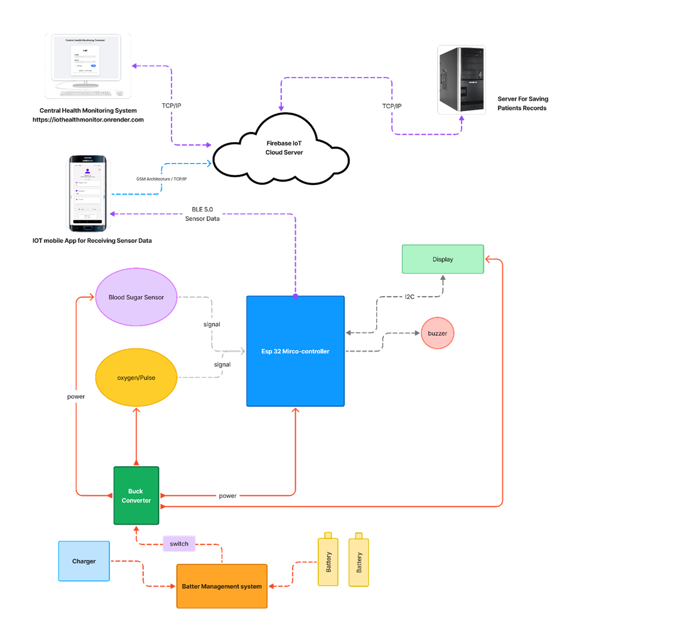

# IOTGlucometerMobileApplication
this is simple yet impactful mobile app that enables measurement of blood sugar and pushes the results to firebase.  the mobile app was designed to interface with a hardware i also built with the Esp32 microcontroller and the max30105 sensor. 

